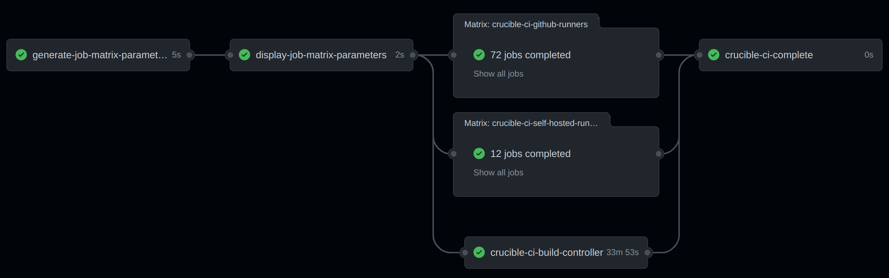

# crucible-ci

## Introduction

Crucible-CI is a Continuous Integration (CI) testing harness targeted at the [Crucible](https://github.com/perftool-incubator/crucible) performance automation and analysis framework.  Crucible is comprised of [many subprojects](https://github.com/perftool-incubator/crucible#subprojects) with each subproject having it's own repository.  As such, the primary goal of Crucible-CI is to be able to perform integration testing of a given subproject when changes to it are proposed via a pull request.

What this means is that when a pull request is submitted for a project that is a member of the Crucible family a working Crucible installation is created using the primary branch of all the other repositories and the proposed code for the specific repository that the pull request is for.  This installation is then used to perform integration testing of the pull request's changes combined with all of the other project's current upstream code.

The intent/goal here is that the upstream code in the primary branch for all repositories in the Crucible family of projects is ready for user delivery and consumption at all times.  This is a very ambitious goal but given the distribution model that Crucible uses, which is distribution of code updates via Git clone/pull from the upstream repositories, we believe it is the most appropriate target.

## Target Environment

Crucible-CI is primarily intended to be executed in the GitHub runner environment (both GitHub hosted and self-hosted runners).  However, some of it's components can be executed outside of a GitHub runner environment in order to provide developers with the ability to integration test their changes prior to pull request submission.  More details on this in the details below.

## Details

Crucible-CI is a collection of [GitHub Actions](https://docs.github.com/en/actions).  Each action in Crucible-CI is unique and can be consumed in one or more [GitHub Action workflows](https://docs.github.com/en/actions/using-workflows/about-workflows).  Here is the current list of provided actions:

- Helper Actions
  - [check-controller-build](README.md#check-controller-build)
  - [get-benchmarks](README.md#get-benchmarks)
  - [get-endpoints](README.md#get-endpoints)
  - [get-userenvs](README.md#get-userenvs)
- Primary Actions
  - [integration-tests](README.md#integration-tests)

The actions are, for the most part, implemented as shell scripts that are provided to GitHub's workflow framework via `action.yml`.  The way in which they are aggregated together is very GitHub specific, but since they are simple shell scripts at their core we can potentially re-use them outside of the GitHub environment.  Where applicable/useful that is described below.

### Helper Actions

These actions are used to provide information that can be used in the workflows in a variety of different ways.  These are not performing any testing of Crucible as it is meant to be used by an end user.

#### check-controller-build

The [check-controller-build](.github/actions/check-controller-build) action is used to determine if changes to the main Crucible repository require the controller image to be rebuilt.

#### get-benchmarks

The [get-benchmarks](.github/actions/get-benchmarks) action is used to determine which benchmarks can be run in the specified runner type.  This is necessary because some benchmarks have requirements that cannot be met by a certain type of runner.  For example, GitHub hosted runners do not provide a CPU isolation environment which some benchmarks require.  Additionally, not all Crucible supported benchmarks are currently supported by Crucible-CI (usually due to special hardware requirements that cannot be met in a runner environment due to cost/complexity).

#### get-endpoints

The [get-endpoints](.github/actions/get-endpoints) action is used to determine which endpoints can be run in the specified runner type.  Some runner environments (such as self hosted) are specifically targeting at testing specific endpoints and this action provides that information.

#### get-userenvs

The [get-userenvs](.github/actions/get-userenvs) action is used to look at a ricksaw repository to determine what the list of currently supported userenvs is.

### Primary Actions

These actions are where actual Crucible testing is performed.

#### integration-tests

The [integration-tests](.github/actions/integration-tests) action is where, as the name implies, the integration testing is performed.  This action has several different possible inputs, but all of them are optional.  By default it will run a very simple integration test based on the default values.  By specifying one or more of the available inputs the action can be "tuned" for the type of testing that is desired in the calling workflow.

The integration test is comprised of multiple shell scripts that perform different actions.  Some of these scripts are usually specific to the GitHub runner environment, such as [setup-ci-environment](.github/actions/integration-tests/setup-ci-environment) (since it performs a custon install of Crucible), while others can be used outside of the Github runner environment to perform testing in a development environment with an existing running Crucible installation.  An example of this is the use of [run-ci-stage1](.github/actions/integration-tests/run-ci-stage1) (which is the actual "test" in this action, the other scripts are primarily for setup and reporting) by the Crucible [`run-ci`](https://github.com/perftool-incubator/crucible/blob/bcdde354c751baff60f8cb9d68203113ec4c3439/bin/_help#L48) command.

## Testing Crucible-CI

Crucible-CI is a subproject in the Crucible family just like any other.  This means that Crucible-CI can be used to test itself when changes to it are proposed.  It also means that Crucible-CI has an [embedded workflow](.github/workflows/crucible-ci.yaml) implemented that demonstrates how it's various actions can be used together to provide a scale-out integration test.

The workflow is comprised of multiple jobs that execute in a coordinated sequence:

- The first job, `generate-job-matrix-parameters`, uses the helper actions described above to obtain information that controls later jobs.
- The second job, `display-job-matrix-parameters`, is a simple one that just reports the information that was obtained in `generate-job-matrix-parameters` in case it is needed for debugging.
- The third job, `crucible-ci-github-runners`, and the forth job, `crucible-ci-self-hosted-runners`, use the information from `generate-job-matrix-parameters` in a "stategy" to generate (potentially large) matrices of test combinations to execute.  Each test that is generated creates a unique job that runs the [integration-tests](README.md#integration-tests) action with the appropriate parameters.  All of the jobs that are created here are queued for execution by the GitHub runners (GitHub hosted or self-hosted depending on the job) and then are executed according to their scheduler and the applicable [usage limits](https://docs.github.com/en/actions/learn-github-actions/usage-limits-billing-and-administration#usage-limits) (currently our GitHub plan is the Free tier).
- The fifth job, `crucible-ci-build-controller`, is a single targeted job that tests the Crucible controller build logic.
- The sixth job, `crucible-ci-complete`, executes when all of the jobs created by `crucible-ci-github-runners`, `crucible-ci-self-hosted-runners`, and `crucible-ci-build-controller` complete.  This is the job that is gating the ability to merge the pull request through GitHub's [branch protection rules](https://docs.github.com/en/repositories/configuring-branches-and-merges-in-your-repository/defining-the-mergeability-of-pull-requests/about-protected-branches#require-status-checks-before-merging).

The general workflow looks like this when it runs to completion without any failures:

When the other projects in the Crucible family use Crucible-CI it should be in a workflow that is most likely, at least in part, derived from this one.  Each project has it's own testing needs and requirements so there may be a fair amount of deviation in some cases, but the general structure and flow should be identifiable.
